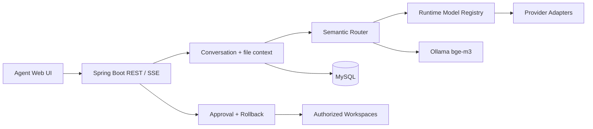

# RouteLoom Agent

一个本地优先、配置驱动的多模型 Agent。它根据问题语义和对话上下文选择任务模型，并把模型生成的文件操作纳入工作区白名单、人工审批、审计和回滚流程。

## 核心能力

- `GENERAL / DAILY / LITERARY / CODING / MATH` 五类模型槽位，可在 Web 页面运行时配置。
- 内嵌 Java Semantic Router，使用 Ollama `bge-m3` 做本地向量编码，支持低置信度、歧义、域外输入和上下文跟随策略。
- 多会话历史共享：同一会话切换模型时仍使用统一聊天记录。
- OpenAI Responses、OpenAI-compatible、Gemini、Anthropic 和 Ollama provider 适配器。
- POST SSE 流式回答；中途失败时前端清除不完整输出并显示错误。
- 可授权多个本机工作区，选择当前文件作为模型上下文。
- UTF-8 文本附件、文件操作人工审批或全权模式、操作审计与逐条回滚。
- MySQL 持久化会话、路由元数据和文件操作记录。

## 架构



详细设计见 [架构文档](docs/architecture.md)。

## 快速开始

### 1. 环境

- JDK 17+，推荐使用 JDK 22
- Maven 3.9+
- MySQL 8.x
- Ollama 与 `bge-m3:latest`

```powershell
ollama pull bge-m3
mysql -u root -p < database/schema.sql
mvn clean test
mvn spring-boot:run
```

也可以只用 Docker 启动 MySQL：

```powershell
docker compose up -d mysql
```

Docker 示例创建的应用账号是 `coder/coder`，启动应用前设置 `DB_PASSWORD=coder`；直接使用本机 MySQL 时仍可保留默认空密码。

访问 [http://localhost:8080](http://localhost:8080)。应用默认只监听 `127.0.0.1`。语义路由向量快照在后台异步构建；预热期间请求会降级到规则路由，不会阻塞应用启动。可通过 `GET /actuator/semanticrouter` 查看快照状态。

### 2. 配置真实模型

仓库默认加载无密钥的 mock 模型，clone 后即可启动。打开页面左下角“模型设置”，为每种任务设置模型名、Base URL、Key、超时、Token 上限和 Temperature。

页面保存的配置位于 `./config/models.local.yml`，该文件已被 `.gitignore` 排除。API 不会返回 Key 原文。详细说明见 [配置指南](docs/configuration.md)。

### 3. 授权工作区

点击工作区标题旁的 `+`，后端会在本机打开原生目录选择器。Agent 只能读取或修改已授权根目录内的路径；绝对路径、`..`、符号链接逃逸和递归删除均会被拒绝。

## Provider 支持

| Provider | 协议 | Key | 流式输出 |
| --- | --- | --- | --- |
| OpenAI | Responses API | 必需 | SSE |
| DeepSeek / 兼容网关 | Chat Completions | 通常必需 | SSE |
| Google Gemini | GenerateContent | 必需 | SSE |
| Anthropic | Messages API | 必需 | SSE |
| Ollama | `/api/chat` | 不需要 | NDJSON |
| LM Studio / LocalAI | OpenAI-compatible | 本机端点可留空 | SSE |

模型目录只是可编辑的 UI 初始选项；provider 最终由模型名和 Base URL 推断，而不是在业务代码中按具体模型硬编码。

## 验证

```powershell
mvn clean test
node --check src/main/resources/static/app.js
```

路由评估报告和数据位于 `docs/`，最终 v7 复杂集、压力集和上下文集结果见 [测试演进总结](docs/semantic-routing-test-evolution-summary.md)。

## 文档

- [架构](docs/architecture.md)
- [配置](docs/configuration.md)
- [API 与 SSE 事件](docs/api.md)
- [安全边界](docs/security.md)
- [贡献指南](CONTRIBUTING.md)
- [内嵌 Semantic Router](model-route-semantic-router/README.md)

## 当前边界

- 仅支持 UTF-8 文本附件和文本文件上下文，不解析 PDF、Office 或图片。
- 回形针原生选择的本地文件可审批修改；浏览器 multipart 上传是只读副本。
- 回滚保存单次操作的文件内容快照，不是完整版本控制系统。
- 直接文件写 API 默认关闭；Agent 修改必须进入提案、审批、审计和冲突检测流程。
- 原生目录选择器要求应用运行在有桌面的本机环境；无头服务器应使用外部 `workspaces.local.yml`。
- 当前是单机单用户设计，不包含登录、租户隔离和远程执行任意程序能力。

## License

[MIT](LICENSE)
