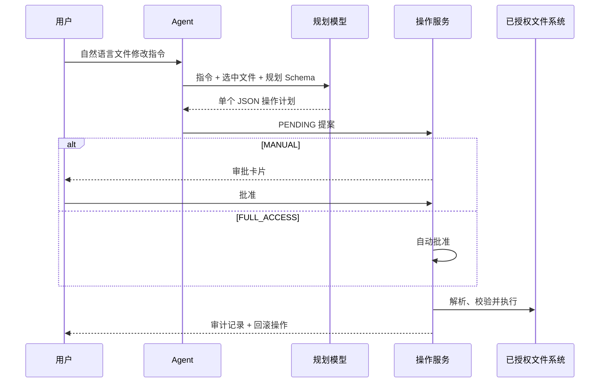
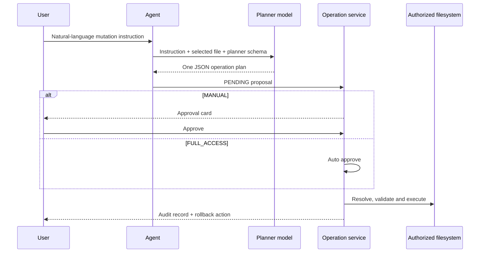

# 系统架构

## 请求处理链路

1. `AgentController` 接收旧版 JSON 对话请求和主要的 POST SSE 流式请求。
2. `AgentStreamService` 创建或解析对话，并加载该对话共享的历史记录。
3. `TaskRouter` 综合焦点提取、语义候选、规则降级和最近一次已知任务类型。
4. `ModelRegistry` 从运行时注册表中解析选定任务对应的模型。
5. `ModelProviderDispatcher` 将请求委派给协议适配器，并返回与 Provider 无关的文本分块。
6. 成功的流式响应会作为一组用户/助手消息持久化；失败的流不会写入数据库。

路由器负责选择业务任务和模型槽位。Provider 适配器只理解传输协议，不包含文学、编程或数学等业务判断。

## 语义路由器

内嵌的 `model-route-semantic-router` 包含两个逻辑模块：

- `semantic-router-core`：配置模型、向量索引、评分、策略和评估。
- `semantic-router-spring-boot-starter`：YAML 加载、Ollama 编码器、热重载、Actuator 和可观测性。

应用路由语料位于 `src/main/resources/semantic-router/routes.yml`。Java 焦点规则和“路由到任务”映射已外置到 `router.yml`。低分、小间隔、域外和歧义结果会先由配置策略处理，再进入业务映射。

## 运行时模型配置

应用提供五个稳定槽位：`general`、`daily`、`literary`、`coding` 和 `math`。更新槽位时会原子替换模型定义、更新语义映射、校验完整注册表，并将快照持久化到被 Git 忽略的本地 YAML。

Provider 类型根据模型名和端点自动推断。新增协议只需实现一个 `ModelProviderClient`，无需修改 `AgentStreamService`。

## 文件安全链路

`FileAccessService` 会拒绝绝对路径、路径穿越、根目录删除、符号链接逃逸、超限读写、创建时覆盖已有文件和对非空目录的递归删除。`FileOperationService` 会在需要时保存操作前内容，并控制操作状态流转。

## 持久化

- `conversation`：业务对话 ID 与标题。
- `chat_message`：共享历史、任务/模型选择和 JSON 路由元数据。
- `conversation_id_sequence`：用于生成重启安全的可见 ID 序列部分。
- `file_operation`：提案、审批、执行、错误和回滚审计状态。

## 前端

界面使用由 Spring Boot 提供的无依赖 HTML/CSS/JavaScript。它通过带 POST 请求体的 `fetch()` 调用接口，并从 `ReadableStream` 中解析 SSE 帧。Provider 分块进入逐字队列；收到任何 `error` 事件后，前端会清除已经累积的助手文本，再显示错误状态。

---

# Architecture

> English Version

## Request pipeline

1. `AgentController` accepts legacy JSON chat requests and the primary POST SSE stream.
2. `AgentStreamService` creates or resolves a conversation and loads its shared history.
3. `TaskRouter` combines focus extraction, semantic candidates, rule fallback, and the last known task type.
4. `ModelRegistry` resolves the selected task model from the runtime registry.
5. `ModelProviderDispatcher` delegates to a protocol adapter and returns provider-neutral text chunks.
6. A successful stream is persisted as one user/assistant exchange. A failed stream is not persisted.

The router selects a business task and model slot. Provider adapters only know transport protocols; they do not contain literature/coding/math business decisions.

## Semantic router

The embedded `model-route-semantic-router` contains two logical modules:

- `semantic-router-core`: configuration model, vector index, scoring, policy and evaluation.
- `semantic-router-spring-boot-starter`: YAML loading, Ollama encoder, reload, Actuator and observability.

Application route data is in `src/main/resources/semantic-router/routes.yml`. Java focus rules and route-to-task mappings are externalized in `router.yml`. Low score, small margin, out-of-domain and ambiguous results are handled by configured policy before business mapping.

## Runtime model configuration

The application exposes five stable slots: `general`, `daily`, `literary`, `coding`, and `math`. Updating a slot replaces its model definition atomically, updates semantic mappings, validates the complete registry, and persists an ignored local YAML snapshot.

The provider type is inferred from model name and endpoint. Adding a new protocol requires a `ModelProviderClient`, not changes in `AgentStreamService`.

## File safety pipeline

`FileAccessService` rejects absolute paths, traversal, root deletion, symlink escape, oversized reads/writes, overwrite-on-create and non-empty recursive deletion. `FileOperationService` captures pre-operation content where required and controls state transitions.

## Persistence

- `conversation`: business conversation identity and title.
- `chat_message`: shared history, task/model selection and JSON route metadata.
- `conversation_id_sequence`: restart-safe sequence component for visible IDs.
- `file_operation`: proposal, approval, execution, error and rollback audit state.

## Frontend

The UI is dependency-free HTML/CSS/JavaScript served by Spring Boot. It uses `fetch()` with a POST body and parses SSE frames from `ReadableStream`. Provider chunks enter a character queue; any `error` event clears the accumulated assistant content before rendering the error state.
